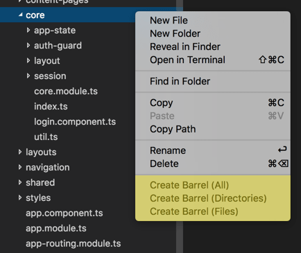

# !Work in Progress!
  Use at your own risk.

# NG.42 TS Helpers

Adds basic helper commands for working with Angular 2 and TypeScript.

Any and all feed back is welcome.

barrellAll

## Features

#### Create Barrels
  
  - Exporer Context menu for creating index.ts with exports for:
   - All TS files and directories in the current directory.
   - All TS files in directory.
   - All directories in the current directory.
   ```
    // index.ts
    export * from './sub-dir';
    export * from './other-sub-dir';
   ```

#### ngRx snippets
- Reducers
  - Create application reducer file ( ngr-app-reducer-file )
  - Create feature reducer file ( ngr-app-feature-file )
  - Create reducer function ( ngr-reducer )
  - Create reducer action case ( ngr-reducer-case )
- Actions
  - Create Action Types constant ( ngr-action-types-map )
  - Create Action Type ( ngr-action-type )
  - Create Action Class ( ngr-action )
  - Create Actions file ( ngr-actions-file )
- Effects
  - Create Effects file ( ngr-effect-file )
  - Create Effect ( ngr-effect )
- Selectors
  - Create Selectors file ( ngr-selector-file )
  - Create Selector ( ngr-selector )
- State
  - Create App State file ( ngr-app-state-file )
  - Create Feature State file ( ngr-feature-state-file )

## Upcoming Features
  - Some useful TypeScript snippets for angular 2.
  - Some scaffolding for ngRx.

## Release Notes

### 0.0.7
- Fixed promise errors preventing the creation of barrels

